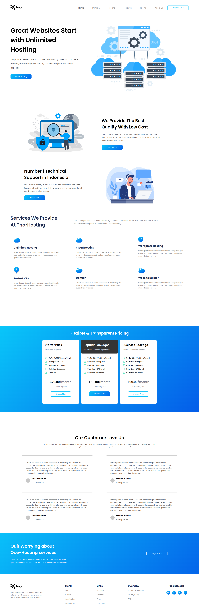

# Project 11

### `Nishok Maharaaj`

## Learnings    

This is the eleventh project of HTML and CSS class where I done most of designing with `positioning`, `margins`, `padding` and `flex-box`. Done hover effects for the cards in the website. Made the site responsive using CSS `@media-queries`.

[Project Live Link](https://nishok-html-css-proj11.netlify.app/)

## Efforts

This project took around 8 hours to build the complex cards, and other components.

### Screenshot

